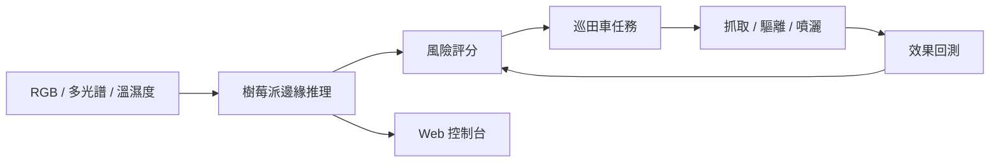

# 智護田 · FieldGuard AI

多模態感知與 AI 驅動的農作物病蟲害智能防治機器人系統網站原型。

這個專案同時是：

- 面向比賽評審與合作方的產品展示網站；
- 面向農戶與運維人員的智慧農田控制台原型；
- 後續連接 ESP32、Raspberry Pi、MQTT 和 LeRobot 的前端基礎。

## 已實現

- 智慧農業品牌首頁與機器人視覺主場景；
- 6 個示範地塊的風險熱力圖；
- 可調整風險分數的互動研判面板；
- 依風險自動切換「監測、補拍、抓取、噴灑」建議；
- 巡田車暫停／繼續與處置指令回饋；
- 感知、決策、執行、回測的閉環說明；
- 雲、邊、端三層技術架構；
- 桌面、平板和手機響應式版面。

目前使用模擬資料，適合直接展示。接入真實硬體時只需將 `src/App.jsx` 中的示範資料替換為 API 或 MQTT WebSocket 資料。

## 快速開始

需要先安裝 [Node.js](https://nodejs.org/) 20 或更高版本。

```bash
npm install
npm run dev
```

瀏覽器開啟終端機顯示的本機網址即可。

正式構建：

```bash
npm run build
npm run preview
```

## 專案結構

```text
.
├── docs/
│   └── website-plan.md   # 網站綱要、功能和技術規劃
├── src/
│   ├── App.jsx           # 頁面結構、示範資料與互動狀態
│   ├── main.jsx          # React 入口
│   └── styles.css        # 品牌視覺、控制台與響應式樣式
├── index.html
└── package.json
```

## 技術棧

- React：組件與互動狀態；
- Vite：本地開發與生產構建；
- Lucide React：一致的介面圖標；
- 原生 CSS：視覺系統、動畫與響應式佈局。

## 硬體與 AI 對接方向



- 機械臂硬體參考 [TheRobotStudio/SO-ARM100](https://github.com/TheRobotStudio/SO-ARM100)。該倉庫目前推薦使用新一代 SO-101，舊 SO-100 文檔已標記為 deprecated。
- 機器人控制、數據採集與策略訓練參考 [huggingface/lerobot](https://github.com/huggingface/lerobot)。
- 完整頁面規劃與後端接口建議見 [docs/website-plan.md](docs/website-plan.md)。

## 資料來源

網站內容依據本項目的兩份研究報告整理，包括多模態感知、連續風險評分、最小必要干預與雲邊端協同架構。網站不包含報告 PDF 原文件。

